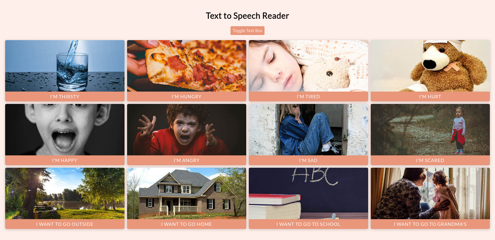

## Text to Speech Reader

A text to speech app for non-verbal people. Pre-made buttons and custom text speech. This project uses the Web Speech API

## Project Specifications

- Responsive UI (CSS Grid) with picture buttons
- Speaks the text when button clicked
- Drop down custom text to speech
- Speaks the text typed in
- Change voices and accents
